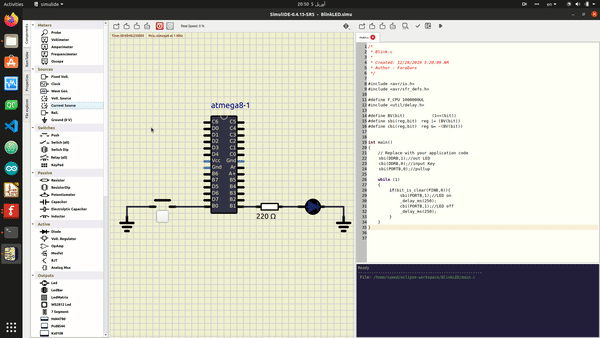

# AVR Documents
*****
## 1.Blinking LED

Blinking an LED is the start of programming microcontrollers. It is a great way to work through the entire development process and make sure all your tools are in working order.
# Step 1: What You Will Need
For this tutorial you will need:

    1) AVR Microcontroller (Atmega8)
    2) Breadboard
    3) LED
    4) 220 Ohm resistor
    5) Push Button

If you would like you can also use simulation software(Proteus in Windows and SimulIDE in Linux).
# Step 2:Diagram and Pcb Blinking LED
In this section, we presented diagram and pcb this circuit in windows and Linux by used Fritzing.

A 10kΩ "pull-up resister" (R1) is connected to the RESET pin to keep the pin in a digital high state.
A Push Button is connected to pin PB0.

A 220Ω resistor (R2) and an LED (LED1) are connected to pin PB1. The resistor is a "current limiting" resistor to limit the current (mA) passing through the LED so that it doesn't burn out. The key be pressed PB1goes high (5V) the LED will turn on Flashing every 250 milliseconds and when the key be released PB1 goes low (0V) the LED turns off.

## Powering The Circuit

The schematic shows a DC power source of +5V to power the microcontroller, however, it's up to you to provide that +5V. One of the most common ways hobbyists use provide +5V to projects is to use a 9V battery with a 7805 voltage regulator IC to drop the voltage down to +5V.

I prefer to use 4 rechargable batteries (4 batteries x 1.2V ea. = 4.8V).

Of course, having a +5V power source in your "lab" (whatever that may be) is invaluable. Hobbyists often get +5V out of a wall outlet by using an expensive lab power supply (which is awesome if you can afford it), using a +5V AC/DC wall adaptor, using the +5V line of an ATX computer power supply, or tapping the +5V line from a USB bus or USB charger.

# Step 3:code Blinking LED
In this section, we used Atmel Studio 7 for code this circuit in windows and Eclipse (Install Plugin Eclipse AVR) in linux.

    /*

     * Blink.c
     *
     * Created: 12/28/2019 3:20:09 AM
     * Author : Saeed Ghorbani
     */

     #include <avr/io.h>

     #include <avr/sfr_defs.h>

     #define F_CPU 1000000UL

     #include <util/delay.h>

     #define BV(bit)			(1<<(bit))

     #define sbi(reg,bit)	reg |= (BV(bit))

     #define cbi(reg,bit)	reg &= ~(BV(bit))

    int main()
    {

      // Replace with your application code

	     sbi(DDRB,1);//out LED

	     cbi(DDRB,0);//input Key

	     sbi(PORTB,0);//pullup

    while (1)
    {
		if(bit_is_clear(PINB,0))
    {
			sbi(PORTB,1);//LED on
			_delay_ms(250);
			cbi(PORTB,1);//LED off
			_delay_ms(250);
	  }

    }

    }

# Step 4: Simulation Blinking LED

## Step 4.1: Simulation Blinking LED in windows
In this section, we used Proteus for simulation this circuit in windows.

  
## Step 4.2: Simulation Blinking LED in Linux
In this section, we used SimulIDE for simulation this circuit in linux.  

*****
